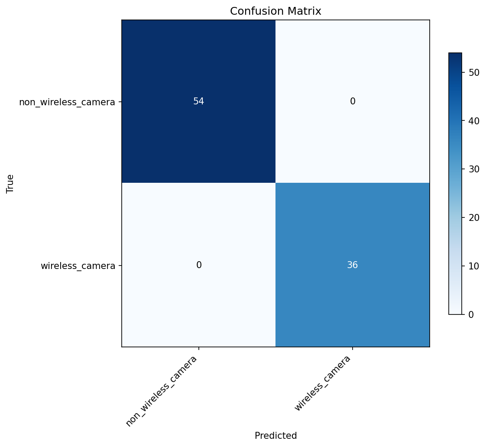
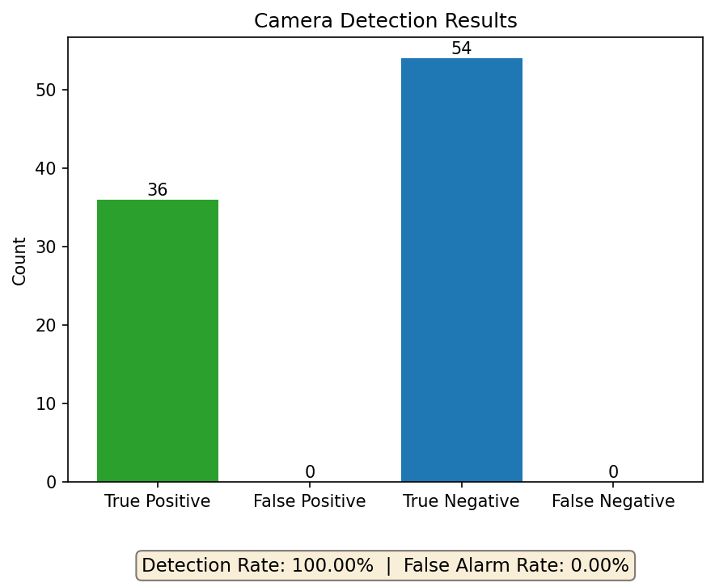
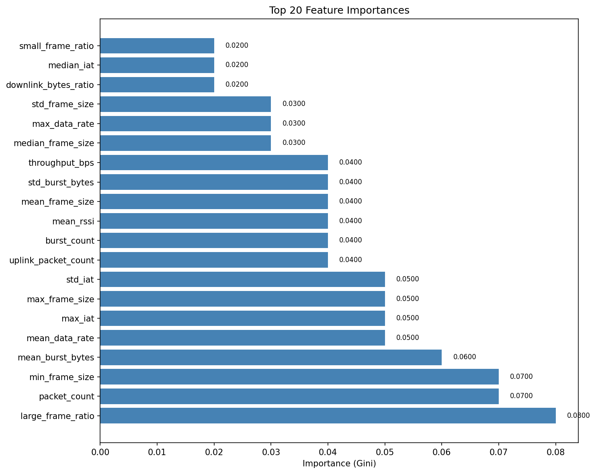
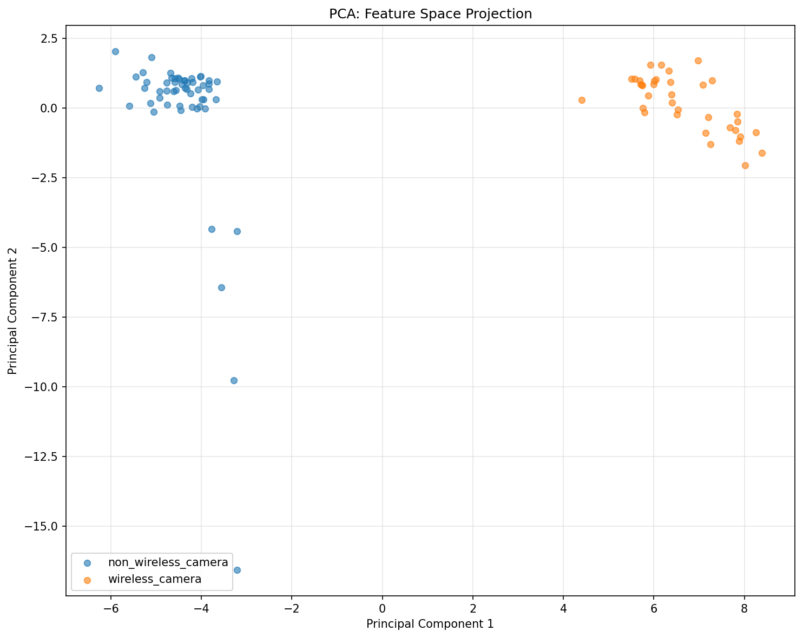
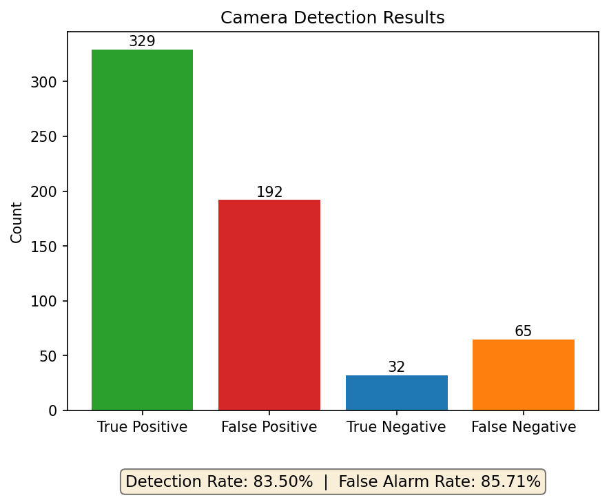
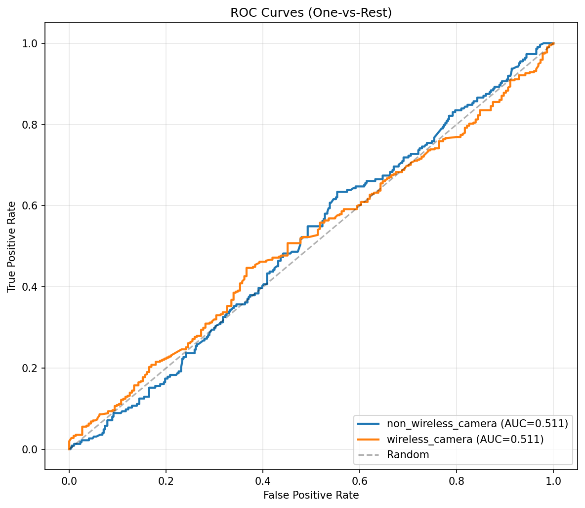

# 测试与结果

## 测试环境

项目要求的采集环境为 Linux/Ubuntu、支持 Monitor 模式的外置 WiFi 网卡、摄像头/手机/平板等终端、Wireshark/tshark 与 aircrack-ng。代码依赖见 `requirements.txt`，主要为 `numpy`、`pandas`、`scikit-learn`、`pyshark`、`scapy`、`matplotlib`、`seaborn`、`joblib` 和 `tqdm`。由于训练代码使用 `StratifiedGroupKFold`，完整 ML 训练评估环境建议满足 scikit-learn 1.3.0 及以上版本。

- **采集工具**：tshark/Wireshark、aircrack-ng、支持 Monitor 模式的无线网卡。
- **分析语言**：Python 3，项目依赖版本以 `requirements.txt` 为准。
- **数据输入**：Monitor 模式采集的 802.11 pcap/pcapng 文件。
- **标注数据**：5 个标注 MAC，其中 2 个 `wireless_camera`、2 个 `tablet`、1 个 `smartphone`。

## 功能测试

功能测试主要覆盖从 pcap 到可疑 MAC 排名的完整链路。仓库中的 `tests/` 覆盖 `PcapReader`、Radiotap 解析、突发检测、帧/流特征、ML 数据集、SVM/RF/ensemble、模型评估与持久化等模块；最终展示结果以 `report/final_device_window_test/`、`report/final_test/` 和 `report/rule_baseline_test/` 下的图表与 JSON/CSV 为准。

| 评估项 | AUC | 检出率 | 误报率 | Precision | F1 | 说明 |
| --- | --- | --- | --- | --- | --- | --- |
| 设备窗口级主结果 | 1.000 | 100.0% | 0.0% | 100.0% | 100.0% | 10 秒 MAC 窗口，TP=36、FP=0、TN=54、FN=0 |
| 规则基线 10 秒窗口 | -- | 100.0% | 0.0% | 100.0% | 100.0% | `camera_score` 阈值 5，结果与主窗口评估一致 |
| 规则基线 1 秒窗口 | -- | 100.0% | 0.22% | 99.72% | 99.86% | TP=360、FP=1、TN=444、FN=0，说明短窗口下仅 1 个误报 |
| flow 级外部复测 | 0.511 | 83.5% | 85.7% | 63.1% | 71.9% | TP=329、FP=192、TN=32、FN=65，用作泛化压力测试 |

### 主结果：MAC 级 10 秒设备窗口评估

<table>
  <tr>
    <th>设备窗口混淆矩阵</th>
    <th>设备窗口检测摘要</th>
  </tr>
  <tr>
    <td></td>
    <td></td>
  </tr>
</table>

### 设备窗口特征解释

<table>
  <tr>
    <th>特征重要性</th>
    <th>PCA 可视化</th>
  </tr>
  <tr>
    <td></td>
    <td></td>
  </tr>
</table>

## 结果分析

主结果表明，按 MAC 聚合后的设备窗口更符合“找摄像头 MAC”这一任务目标。当前标注样本中，摄像头窗口与非摄像头窗口在大帧比例、包量、突发字节数、数据速率、IAT 统计和上行相关特征上可分性较强，因此设备窗口级 AUC 达到 1.000，且无误报、无漏报。

特征重要性图中靠前的特征包括 `large_frame_ratio`、`packet_count`、`min_frame_size`、`mean_burst_bytes`、`mean_data_rate`、`max_iat`、`std_iat`、`uplink_packet_count` 和 `burst_count`。这些特征与摄像头持续上传视频的行为一致：视频流会产生较多数据帧、较高大帧比例、较明显的突发字节数以及相对稳定的发送节奏。由于训练中删除了 MAC/OUI/source file 等身份字段，模型结果更能反映流量行为而非设备记忆。

### 压力测试：flow 粒度外部复测

<table>
  <tr>
    <th>flow 外部复测检测摘要</th>
    <th>flow 外部复测 ROC</th>
  </tr>
  <tr>
    <td></td>
    <td></td>
  </tr>
</table>

flow 级外部复测 AUC 为 0.511，误报率为 85.7%。这个结果没有被作为主结论，而是用于说明单 flow 粒度的局限：flow 只是 SA->DA 的碎片化通信片段，跨场景时普通手机视频通话、直播推流、云盘上传、AP 管理帧等 hard negatives 也会呈现大帧、上行和突发特征，导致模型误报。后续需要补充更多 hard negatives，并按房间、日期、设备做 group split，进一步验证泛化能力。
